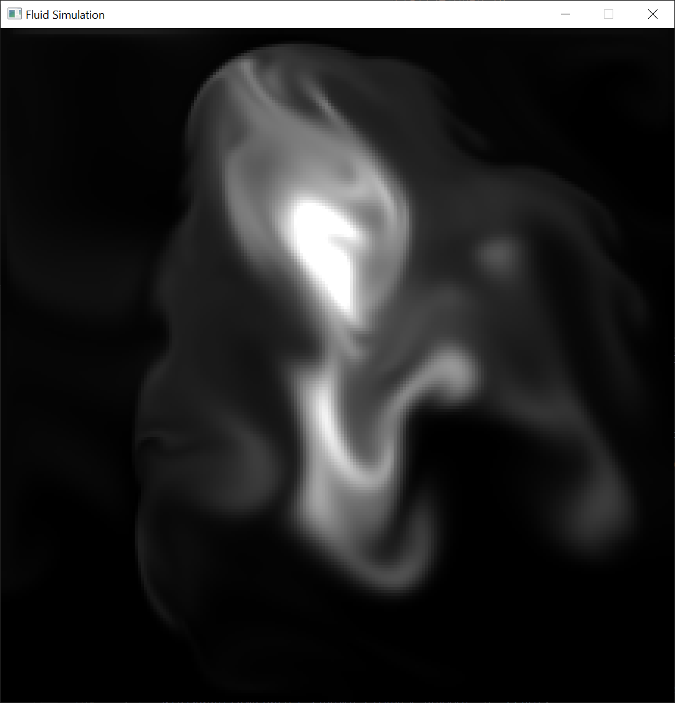
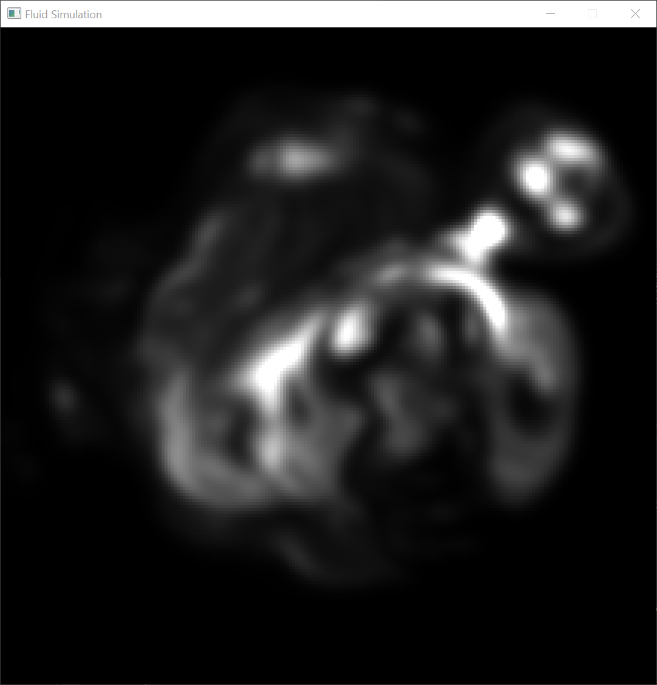
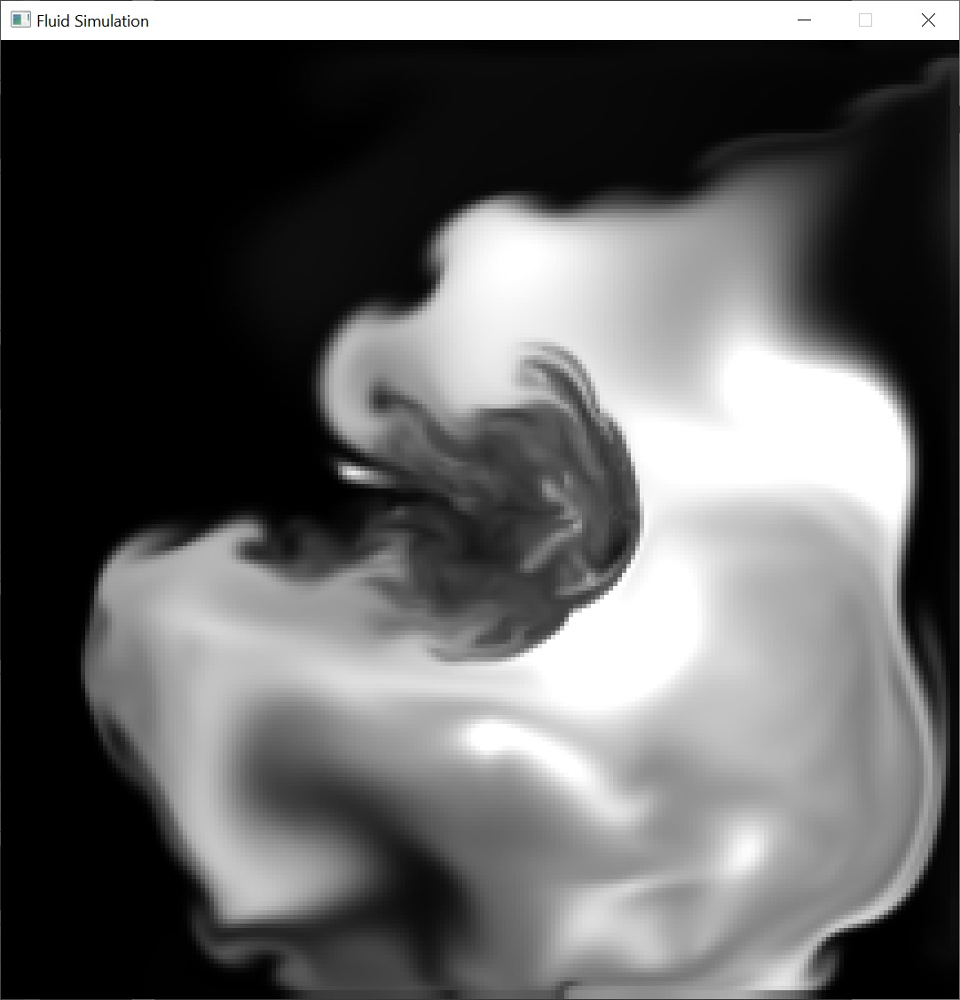
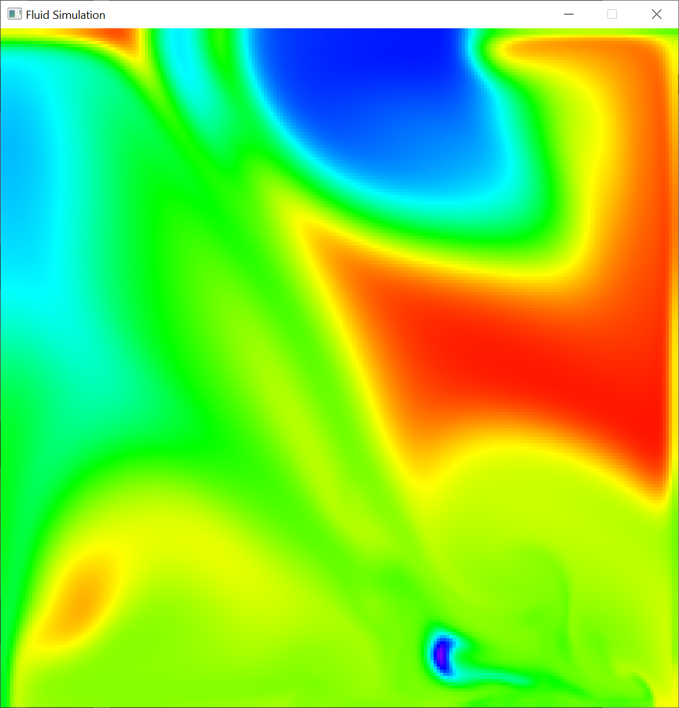

# 2D Fluid Simulation (C++)

## Overview

This project is a simple 2D Fluid Simulator, a real-time fluid dynamics implementation in C++ and OpenGL 4.3. This simulator is inspired by the principles presented in the paper ["Real-time fluid dynamics for games"](https://damassets.autodesk.net/content/dam/autodesk/www/autodesk-reasearch/Publications/pdf/realtime-fluid-dynamics-for.pdf) by Jos Stam.

## Key Features
- **Stable Fluid Dynamics:** Implements stable and efficient fluid dynamics techniques for real-time simulation.
- **Grid-based Simulation:** Utilizes a grid-based approach for simulating fluid behavior in a discrete space.
- **Interactive Visualization:** Provides an interactive visualization of fluid flow and dynamics in a graphical environment.

## Implementation Details

- **Programming Language:** C++17
- **Graphics API:** OpenGL 4.3
- **Navier-Stokes Equations:** The simulator's core utilizes numerical methods to solve the Navier-Stokes equations for fluid flow.
- **MAC Grids:** Utilizes Marker-and-Cell (MAC) grids for accurate representation and simulation of fluid properties.

## Requirements
- Microsoft Visual Studio 2022
- OpenGL 4.3+ support

## Getting Started
1. Clone the repository: `git clone https://github.com/MisaelVM/Fluid-Simulation.git`.
2. Navigate to the project directory: `cd Fluid-Simulation`.
3. Open the solution `Fluid Simulation.sln` with Visual Studio.
4. Run the project.

## Simulator controls
- `Left Click`: Click and drag the mouse to generate fluid on the viewport.
- `A`: Sets the current color space to RGB color space (grayscale).
- `S`: Sets the current color space to HSV color space.
- `R`: Resets the simulator. Clears the fluid.
- `Escape`: Closes the application.

## Visual Results

## Acknowledgements
The implementation is based on the paper ["Real-time fluid dynamics for games"](#references) by Jos Stam.

## References
- Stam, J. (2003, March). Real-time fluid dynamics for games. In *Proceedings of the game developer conference* (Vol. 18, p. 25).
